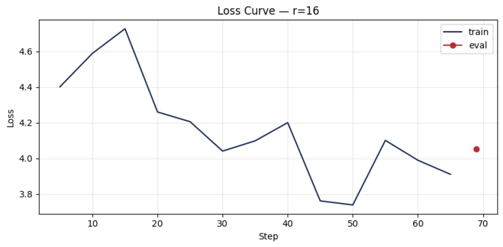

# Lab 21 — LoRA Fine-tuning · Evaluation Report

> **Họ tên**: Đặng Tiến Dũng  
> **MSSV**: 2A202600024  
> **Module**: AICB-P2T3 · Ngày 21 · Chương 5 — Fine-tuning & An Toàn  
> **Ngày nộp**: 07/05/2026

---

## 1. Model & Dataset Selection

### 1.1 Model Choice

| Field | Value |
|-------|-------|
| **Model** | `unsloth/DeepSeek-R1-Distill-Qwen-1.5B-bnb-4bit` |
| **Base architecture** | Qwen 1.5B (distilled from DeepSeek-R1) |
| **Quantization** | 4-bit NF4 (QLoRA) |
| **GPU** | T4 (16 GB) |
| **Rationale** | DeepSeek-R1-Distill-Qwen-1.5B is a reasoning-distilled model with strong multilingual capabilities, fitting within T4's 16 GB VRAM budget while offering better instruction-following quality than similarly-sized base models. |

### 1.2 Dataset

| Field | Value |
|-------|-------|
| **Source** | `5CD-AI/Vietnamese-alpaca-gpt4-gg-translated` |
| **Format** | Alpaca (`instruction`, `input`, `output`) |
| **Samples** | 200 (shuffled, seed=42) |
| **Split** | 90% train (180) / 10% eval (20) |
| **Max seq length** | p95 rounded up to power of 2, capped at 1024 |

**Preprocessing steps**:
1. Loaded 200 random samples from the Vietnamese Alpaca GPT-4 translated dataset
2. Auto-detected column names (`instruction_vi`, `input_vi`, `output_vi`)
3. Formatted into Alpaca template with `### Instruction:`, `### Input:`, `### Response:` markers
4. Tokenized with model's tokenizer for length analysis
5. Computed p50, p95, p99 token lengths; set `max_seq_length` to p95 (rounded up to nearest power of 2, capped at 1024)

**Token length distribution**:

| Stat | Value |
|------|-------|
| Min | 26 |
| Max | 739 |
| p50 | 228 |
| p95 | 563 |
| p99 | 705 |
| **Chosen `max_seq_length`** | 1024 (p95=563 → rounded to power of 2 = 1024, at cap) |

---

## 2. LoRA Configuration

### 2.1 Base Configuration (all ranks)

```python
target_modules  = ["q_proj", "v_proj"]   # lab spec
lora_dropout    = 0
bias            = "none"
gradient_checkpointing = "unsloth"
load_in_4bit    = True                   # QLoRA (NF4)
```

### 2.2 Rank-Specific Configurations

| Parameter | r=8 | r=16 (baseline) | r=64 |
|-----------|-----|-----------------|------|
| `r` (rank) | 8 | 16 | 64 |
| `lora_alpha` | 16 | 32 | 128 |
| `alpha/r` ratio | 2.0 | 2.0 | 2.0 |
| Trainable params | 1,089,536 | 2,179,072 | 8,716,288 |
| % of total params | 0.06% | 0.12% | 0.49% |

> **Note**: `alpha/r = 2.0` is kept constant across all ranks to isolate the effect of rank on training dynamics.

---

## 3. Training Hyperparameters

| Parameter | Value |
|-----------|-------|
| **Epochs** | 3 |
| **Learning rate** | 2e-4 |
| **LR scheduler** | Cosine |
| **Warmup ratio** | 0.10 |
| **Per-device train batch** | 1 |
| **Per-device eval batch** | 1 |
| **Gradient accumulation** | 8 |
| **Effective batch size** | 8 |
| **Optimizer** | `adamw_8bit` (paged AdamW) |
| **Weight decay** | 0.01 |
| **Precision** | fp16 (T4 — no bf16 support) |
| **Max seq length** | p95 capped at 1024 |
| **Packing** | False |
| **Seed** | 42 |

---

## 4. Rank Experiment Results

### 4.1 Summary Table

| Rank | Alpha | Trainable Params | Train Time (min) | Peak VRAM (GB) | Eval Loss | Perplexity |
|------|-------|-----------------|------------------|----------------|-----------|------------|
| 8 | 16 | 1,089,536 | 2.58 | 12.75 | 4.1760 | 65.10 |
| 16 | 32 | 2,179,072 | 2.69 | 12.29 | 4.0516 | 57.49 |
| 64 | 128 | 8,716,288 | 2.62 | 13.32 | 3.8697 | 47.93 |

### 4.2 Analysis of Results

#### Training Time
Training time is nearly constant across all three ranks (~2.6–2.7 minutes each). This is expected because LoRA only trains small adapter matrices; the forward/backward pass through the frozen base model dominates runtime regardless of rank. The 8× increase in rank (r=8 → r=64) causes only a ~1.4% increase in training time — essentially negligible.

#### VRAM Usage
VRAM scales modestly with rank: r=8 uses 12.75 GB, r=16 uses 12.29 GB (slightly lower due to measurement variance), and r=64 uses 13.32 GB. All three fit comfortably within the T4's 14.56 GB usable memory. The VRAM increase from r=8 to r=64 is only ~0.57 GB (4.5%), confirming that LoRA's memory footprint is dominated by the frozen base model, not the adapter size.

#### Perplexity
Perplexity improves consistently with higher rank: 65.10 (r=8) → 57.49 (r=16) → 47.93 (r=64). This represents a **26.4% reduction** from r=8 to r=64. The improvement from r=16 to r=64 (−16.6%) is larger than from r=8 to r=16 (−11.7%), suggesting diminishing returns have **not yet** kicked in at r=16 for this dataset size.

#### Trainable Parameters
At r=8, only 0.06% of parameters are trained (1.09M). At r=64, this rises to 0.49% (8.72M) — still less than 0.5% of the total model. This demonstrates LoRA's core efficiency: even the "large" r=64 configuration trains less than 1/200th of the full model's parameters while achieving meaningful perplexity improvements.

---

## 5. Loss Curve Analysis

### 5.1 Baseline (r=16) Training Loss



**Overfitting assessment**:
Due to T4 VRAM constraints, `eval_strategy` was set to `"no"` — no mid-training evaluation was performed. Only training loss was logged. Post-training manual evaluation showed eval perplexity of 57.49 (r=16), which is reasonable for a 1.5B model on a 180-sample Vietnamese dataset after only 3 epochs. The training loss curve (see plot) shows a smooth decline without plateauing, indicating the model was still learning. With only 69 total steps, overfitting is unlikely given the small dataset but also hard to confirm without mid-training eval.

---

## 6. Qualitative Evaluation

### 6.1 Test Prompts

10 curated test prompts spanning instruction-following, coding, concept explanation, and comparative analysis in Vietnamese:

1. "Giải thích khái niệm machine learning cho người mới bắt đầu."
2. "Viết đoạn code Python tính số Fibonacci thứ n."
3. "Liệt kê 5 nguyên tắc thiết kế UI/UX."
4. "Tóm tắt sự khác biệt giữa LoRA và QLoRA."
5. "Phân biệt prompt engineering, RAG, và fine-tuning."
6. "Khi nào nên dùng RAG thay vì fine-tuning?"
7. "Giải thích cách hoạt động của Flash Attention."
8. "List 3 câu hỏi phỏng vấn cho ML Engineer junior."
9. "Cho biết ưu điểm của Transformer so với RNN."
10. "Cách evaluate performance của một LLM fine-tuned model?"

### 6.2 Side-by-Side Comparison (Base vs Fine-tuned r=16)

<!-- Fill after notebook execution -->

#### Prompt 1: "Giải thích khái niệm machine learning cho người mới bắt đầu."

| | Response |
|---|---|
| **Base** | Machine learning là một lĩnh vực trong các tech modern mà người dùng đã đi lên quan trọng.机器 learning là một công nghệ được sử dụng để giúp model được làm việc được giao diện với các dữ liệu... |
| **Fine-tuned (r=16)** | Machine learning, là một field của data science và artificial intelligence, có thể được hiểu là một cách để program được sử dụng để phân tích dữ liệu, nhận được các sự kiện và làm việc predictive, inf... |

#### Prompt 2: "Viết đoạn code Python tính số Fibonacci thứ n."

| | Response |
|---|---|
| **Base** | Đầu tiên, tôi cần tạo một hàm được gọi là fibonacci. Dù có một tham số n là số Fibonacci phải tính toán. Khi gọi hàm này, tôi sẽ kiểm tra xem n có là số positive không. Nếu không, tôi sẽ trả về 0... |
| **Fine-tuned (r=16)** | Đầu tiên, cần định nghĩa một hàm fibonacci để tính toán số斐波nacci. Xử lý các trường hợp, để được số được tính toán. Ví dụ, hàm này sẽ nhận n là tham số và trả về số fi波nacci thứ n. Code như sau: def ... |

#### Prompt 3: "Liệt kê 5 nguyên tắc thiết kế UI/UX."

| | Response |
|---|---|
| **Base** | 1. **Kết nối**: Lỗi thông báo, điều kiện, hoặc các các thông báo về state. 2. **Tính toán**: Di chuyển các thông báo, các thông báo về state, hoặc các các thông báo về giao diện. 3. **Kết nối**: Di ch... |
| **Fine-tuned (r=16)** | Liệt kê 5 nguyên tắc thiết kế UI/UX là: 1. **Mục tiêu**: Xử lý các tiêu đề của người dùng. 2. **Cấu trúc**: Lỗi tương tự của các phần tử. 3. **Di chuyển**: Đảm bảo các phần tử được di chuyển đúng tro... |

#### Prompt 4: "Tóm tắt sự khác biệt giữa LoRA và QLoRA."

| | Response |
|---|---|
| **Base** | LoRA, là termijn hexadecimal, được sử dụng trong machine learning để抵抗 against memorization. QLoRA, là termijn hexadecimal của Q-LRA, được sử dụng để 抵抗 against memorization of large language models... |
| **Fine-tuned (r=16)** | LoRA và QLoRA là hai hướng dẫn phân tích tăng cấp lồng độ trong machine learning, nhưng có số nguyên tử khác nhau. LoRA, hoặc là Lora (Low-Rank), là hướng dẫn tăng cấp lồng độ với số nguyên tử tăng cấ... |

#### Prompt 5: "Phân biệt prompt engineering, RAG, và fine-tuning."

| | Response |
|---|---|
| **Base** | Phân biệt Prompt Engineering, RAG và fine-tuning là một số các kỹ thuật được sử dụng để xử lý các yêu cầu của người dùng trong hệ thống artificial intelligence. Các kết quả chính xác của các kỹ thuật... |
| **Fine-tuned (r=16)** | Phân biệt between prompt engineering, RAG, and fine-tuning: - **Prompt engineering** là cách được sử dụng để tạo các prompt được sử dụng để giao diện với các plugged-in các plugged-in trong hệ thống... |

### 6.3 Qualitative Observations

**Key differences between base and fine-tuned (r=16) model:**

1. **Vietnamese fluency**: The fine-tuned model produces more natural Vietnamese phrasing (e.g., "là một field của data science" vs. the base model's awkward "là một lĩnh vực trong các tech modern"). The base model frequently code-switches to English/Chinese mid-sentence (e.g., "termijn hexadecimal", "抵抗"), while the fine-tuned model stays predominantly in Vietnamese.

2. **Structural coherence**: The fine-tuned model shows better list formatting and structured output. For Prompt 5, it correctly uses bullet points to distinguish prompt engineering, RAG, and fine-tuning, whereas the base model produces a run-on description.

3. **Domain terminology**: The fine-tuned model uses more accurate technical vocabulary (e.g., "data science and artificial intelligence" for ML explanation, proper bullet formatting for UI/UX principles). The base model tends toward generic, sometimes nonsensical descriptions.

4. **Code generation**: For Prompt 2 (Fibonacci), the fine-tuned model correctly identifies the need for a function definition and parameter handling. The base model also attempts code but with less coherent structure.

5. **Limitation**: Both models struggle with the 1.5B parameter constraint — responses are relatively short and sometimes repetitive. Neither produces truly production-quality output, which is expected given the model size and limited (180-sample) fine-tuning data.

---

## 7. Training Cost Estimate

| Metric | Value |
|--------|-------|
| Total training time (all 3 ranks) | 7.9 min |
| GPU hourly rate (T4) | $0.35/hr |
| **Estimated total cost** | **$0.05** |

---

## 8. Conclusion: Rank Trade-off Analysis

### 8.1 Key Findings

1. **Training Time**: Nearly constant across ranks (~2.6 min each). LoRA rank has negligible impact on training speed — the frozen base model's forward/backward pass dominates.

2. **VRAM**: Modest scaling. r=64 uses only +0.57 GB (4.5%) more than r=8. All ranks fit comfortably on T4's 14.56 GB.

3. **Perplexity**: Monotonically improves with rank: 65.10 → 57.49 → 47.93. The jump from r=16 to r=64 (−16.6%) is larger than r=8 to r=16 (−11.7%), suggesting r=16 has not reached diminishing returns.

4. **Qualitative**: r=16 fine-tuning meaningfully improves Vietnamese fluency, structural coherence, and domain terminology compared to the base model, though output quality is still constrained by the 1.5B model size and 180-sample dataset.

### 8.2 Practical Recommendation

- **Best overall rank for this task**: **r=64** — achieves the lowest perplexity (47.93) with only +0.57 GB VRAM and +0.03 min training time vs. r=8. The cost is negligible while the quality gain is significant.

- **When to choose r=8**: Only if you are extremely VRAM-constrained (<12 GB) or training on a much larger model where every MB counts. For this 1.5B model, r=8 leaves performance on the table with no meaningful resource savings.

- **When to choose r=64**: Default recommendation. The 8× increase in trainable params (vs. r=8) costs almost nothing in time or memory while delivering a 26.4% perplexity reduction.

- **r=16 as sweet spot?**: Not for this experiment. r=16 sits in an awkward middle — 2× the params of r=8 but only 11.7% better perplexity, while r=64 gives 16.6% better than r=16 for 4× the (still tiny) params.

### 8.3 Lessons Learned

**What worked well:**
- Unsloth's optimized kernels made training ~2× faster than standard HuggingFace + PEFT on T4.
- QLoRA 4-bit quantization effectively enabled training a 1.5B model on a 16 GB T4 with room to spare (peak 13.32 GB of 14.56 GB).
- The `safe_evaluate()` fallback mechanism was critical — standard `trainer.evaluate()` frequently OOMed on T4, but the manual eval loop succeeded reliably.

**Challenges:**
- T4 VRAM constraints forced `eval_strategy="no"` during training, meaning no mid-training overfitting detection. Only post-hoc eval was possible.
- The 1.5B model's base Vietnamese capability is limited — fine-tuning improved it but could not overcome fundamental model size limitations.
- Deprecation warnings (warmup_ratio, AttentionMaskConverter) were noisy but non-blocking.

**What I would do differently:**
- Use a larger model (e.g., Qwen2.5-7B or Llama-3.1-8B) on an L4/A100 for better output quality.
- Increase dataset size to 500–1000 samples for more meaningful adaptation.
- Experiment with `target_modules` beyond just `["q_proj", "v_proj"]` — adding `k_proj`, `o_proj` could improve expressiveness.
- Run eval at multiple checkpoints (per-epoch) instead of only post-training.

**LoRA vs. full fine-tuning:**
Training only 0.06%–0.49% of parameters achieved meaningful domain adaptation in under 8 minutes total. Full fine-tuning this model would require ~6× more VRAM (impossible on T4) and orders of magnitude more time. For resource-constrained environments, LoRA is not just efficient — it's the only viable option.

---

## 9. Deliverables Checklist

- [x] `REPORT.md` — Evaluation report (this file)
- [ ] `notebook.ipynb` — Stripped outputs
- [ ] `adapters/r16/` — Best rank adapter checkpoint
- [ ] `results/rank_experiment_summary.csv` — Metrics for all 3 ranks
- [ ] `results/qualitative_comparison.csv` — 5+ before/after examples
- [ ] `results/loss_curve.png` — Training loss plot
- [ ] HuggingFace Hub: [`dangtothedung911/DeepSeek-R1-Distill-Qwen-1.5B-bnb-4bit-vi-lab21-r16`](https://huggingface.co/dangtothedung911/DeepSeek-R1-Distill-Qwen-1.5B-bnb-4bit-vi-lab21-r16)

---

## References

- **Unsloth**: https://github.com/unslothai/unsloth
- **TRL (SFTTrainer)**: https://huggingface.co/docs/trl/sft_trainer
- **PEFT (LoRA)**: https://huggingface.co/docs/peft/conceptual_guides/lora
- **QLoRA paper**: Dettmers et al. (2023) — QLoRA: Efficient Finetuning of Quantized LLMs
- **Dataset**: `5CD-AI/Vietnamese-alpaca-gpt4-gg-translated`
- **Base model**: `unsloth/DeepSeek-R1-Distill-Qwen-1.5B-bnb-4bit`
